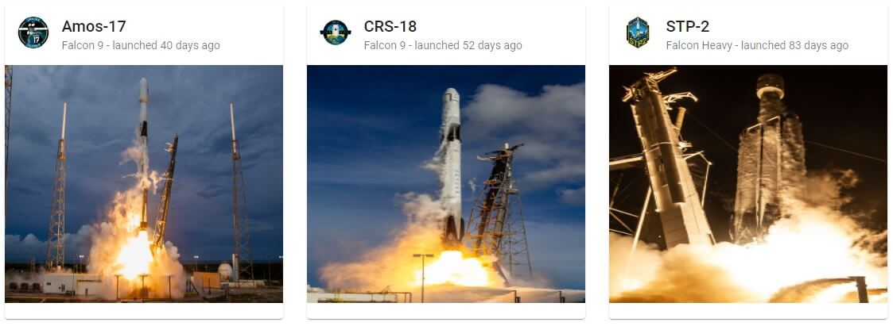

# Angular Spacex Graphql 

Angular app with a list of the past SpaceX launches along with an associated details page. Data is provided via the [SpaceX GraphQL API](https://medium.com/open-graphql/launching-spacex-graphql-api-b3d7029086e0) and Angular services are generated via [GraphQL Code Generator](https://graphql-code-generator.com/). We use [Apollo Angular](https://www.apollographql.com/docs/angular/) to access data from the frontend.
## End Result

